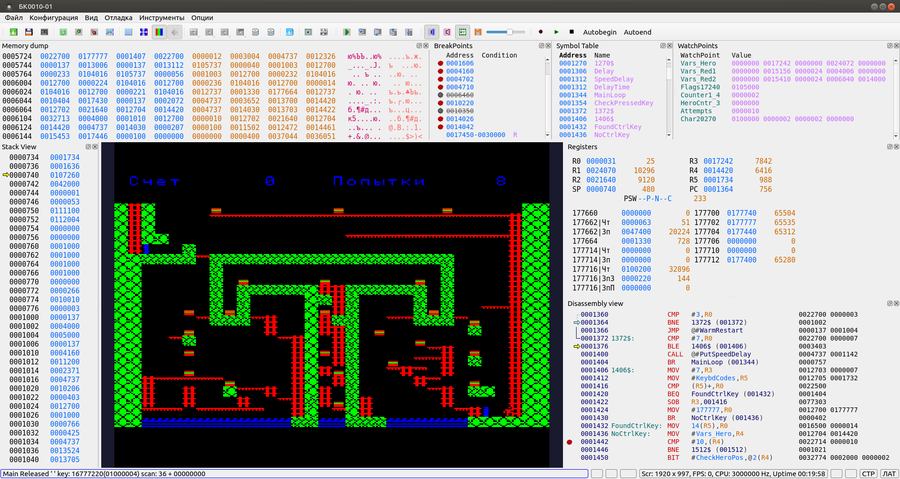

# BKEmu BK-0010(11)(M) Qt Linux

Qt port of BKEmu BK-0010 Family emulator ([http://gid.pdp-11.ru/](http://gid.pdp-11.ru/ "http://gid.pdp-11.ru/")) with many improvements in Debugger.
All models of BK-0010(11) implemented in the original version are working. Some additional features not affecting the main Emulator functionality like Configuration editor, Palitre editor, etc. are not implemented yet. Work still in progress...

Because the main goal was to make the emulator working in Linux, it supports OpenGL screen view only and use OpenAL for audio output. 
All development done in Qt 5.15.2

## Emulator improvements for Debugging

- Plain and Conditional breakpoints. Memory Access breakpoints (Read/Write memory region). Each breakpoint can be enabled/disabled. Conditional breakpoints use Lua as backend and some predefined variale and functions:
   - predefined variables **R0-R5**, **SP**, **PS**, **PWS** for accessing RON values
   - **mem(addr)** for accessing uint16 value at the addr
   - **memb(addr)** for accessing uint8 value at the addr
   - Symbol name or **var("symbol name")** to get value of the symbol. To get value from the memory address pointed by symbol use **mem(symbol)**
   - Bit operations are natively supported by Lua engine
- Save/Load breakpoints
- Time machine. You can step back/forward from any instruction with restoring correct state of RONs/Memory. For now Step Back/Forward does not update periferal's registers (Timer, FDD controller) correctly. StepIn/StepOver will execute Backtrace Step Forward/StepOver up to the head of the Step Backward queue if we stepped back. Hot keys:
   - F7       - Step Backward Over. For SOB it step to the instruction before beginning os SOB cycle. For RTS/RTI/RTT it steps to the instruction calling the subroutine
   - F8       - Step Backward In. Step to the previous executed instruction
   - F9       - Fast Step Forward until the end of Backtrace queue
   - Shift-F9 - Set head of the Step Backward queue to the current PC. Use with caution because Step Backward saves only RONs/Memory/Commmon System Regs
- Symbol table. Emulator can load ether .STB file generated by pclink11 ([https://github.com/andpp/pclink11](https://github.com/andpp/pclink11 "https://github.com/andpp/pclink11")) or .LST file generated by BKTurbo8 (http://gid.pdp-11.ru/). Also symbols can be added directly in Debug view or in Symbol Table View panel.
- Save/Load symbol table. Store symbol table in extended .STB format supporintg long symbol names. Symbols also can be loaded from .LST produced by BKTurbo8.
- Watchpoints. Watch variables and small memory regions.
- Lua-based scripts. Work in progress. Can be used for starting make/build for an assembler project and copy resultes binary files to mounted disk image.
- Initial multilanguage support. User interface currently supports Russian & English language.

## Assembler development tools

Macro11 assembler ([https://github.com/andpp/macro11](https://github.com/andpp/macro11 "https://github.com/andpp/macro11")) and pclink11 linker ([https://github.com/andpp/pclink11](https://github.com/andpp/pclink11 "https://github.com/andpp/pclink11")) were updated for supporting long symbol names. Also all string data definitions in assembled file optioanly could be stored to .obj as BK KOI-8 characters.

Linker can generate BK-0010 .bin files with Load address and Program length as the first two words. Work in progress for creating a command line port of BKDE ([http://gid.pdp-11.ru/](http://gid.pdp-11.ru/ "http://gid.pdp-11.ru/")) for copying images to/from BK .IMG files and intergare it to bkemu-qt. The idea is to create a simple build/debug environment.

Also there is a [port to Linux](https://github.com/andpp/BKTurbo8 "https://github.com/andpp/BKTurbo8") for BKTurbo8 assembler/linker from ([http://gid.pdp-11.ru/](http://gid.pdp-11.ru/ "http://gid.pdp-11.ru/")). Because the main goal of the port was just make it working, it supports only files in UTF-8 encoding. Other encodings supported by the original BKTurbo8 (UTF-16, KOI-8) possibly will be added later.

