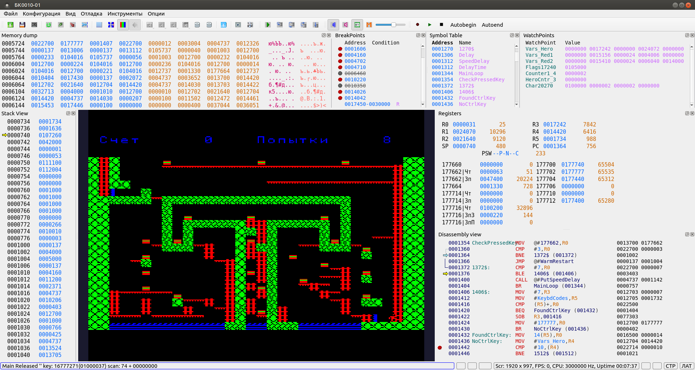

# BKEmu BK-0010(11)(M) порт в Qt Linux

BKEmu BK-0010(11)(M) эмулятор ([http://gid.pdp-11.ru/](http://gid.pdp-11.ru/ "http://gid.pdp-11.ru/")) потрированный на Linux со множеством улучшений во встроенном отладчике.
Эмулируются все модели BK-0010(11)(M) включенные в оригинальную версию. Некоторые второстепенные сервисные функции оригинального эмулятора, не влияющие на основную работу, портированны не полностью. Работа по портирования продолжается.

Основной целью данного проекта было перенести эмулятор в Linux, в отличие от оригинала он работает только с OpenGL и использует OpenAL для вывода звука. Разработка ведется в Qt 5.15.2

## Улучшения в эмуляторе

- Таблица символов. Эмулятор может загружать символы из .STB файла, сгенерированного pclink11 ([https://github.com/andpp/pclink11](https://github.com/andpp/pclink11 "https://github.com/andpp/pclink11")) или из .LST файла сгенерированного BKTurbo8 (http://gid.pdp-11.ru/). Так же имена символов могут быть добавлены/отредактированны в прорамме либо на панели управления таблицей символов, либо непосредственно в окне отладчика.
- Таблица символов может быть охранена в расширенном .STB формате, поддерживающим длинные имена символов.
- Watchpoints. Выводит значения отдельных переменных либо небольших регионов памяти.
- Реализована полная поддержка обычных и условных точек останова, останов по доступу (чтение/запись) к области памяти. Любая точка останова может быть временно отключена. 
- Условные точки останова используют Lua5.4 для обработки сткриптов условий. Для удобства написания условий останова в  скриптах можно использовать предопределенные переменные и функции
   - предопределенные переменные **R0-R5**, **SP**, **PS**, **PWS** для доступа к РОН
   - **mem(addr)** для чтения uint16 значения из addr
   - **memb(addr)** для чтения uint8 значения из addr
   - Имя символа или **var("имя_символа")** для доступа к значению переменной. Если в переменной храниться указатель на значение, значение можно получить используя **mem(имя_символа)**
   - Поддержка битовые опраций осуществляется Lua. Так как синтакс для битовых операций в Lua несколько отличается от C, см. [Lua 5.4 Reference Manual](https://www.lua.org/manual/5.4/ "https://www.lua.org/manual/5.4/") или на русском: [Lua 5.3 Руководство](http://lua.org.ru/contents_ru.html "http://lua.org.ru/contents_ru.html")
- Загрузка/сохранение точек останова, watchpoints, участков памяти.
- Машина времени. Возможность сделать в отладчике шаг назад с восстановлением предыдущих значений регистров и памати. Для некоторых переферийных устройств, таких как контроллер диска или муз. сопроцессор значения регистров не будут восстановлены. Обратный шаг поддерживает StepOver, что позволяет вернуться к точке вызова подпрограммы или началу цикла SOB. Если сделаны шаги назад, отладчик будет корректно делать эмуляцию шалов вперед до тех пор, пока не достигнет исходний точки. После этого эмулятор продолжить выполнять иснтрукции процессора как обычно. Горыцие клавиши, используемые в отладчике:
- Time machine. You can step back/forward from any instruction with restoring correct state of RONs/Memory. For now Step Back/Forward does not update periferal's registers (Timer, FDD controller) correctly. StepIn/StepOver will execute Backtrace Step Forward/StepOver up to the head of the Step Backward queue if we stepped back. Hot keys:
   - F7       - Шаг назад через. Для SOB  делаются шаги назад пока PC не достигнет инструкции перед началом SOB цикла. Для RTS/RTI/RTT делаются шаги назад пока PC не достигнет инструкции вызава подпрограммы или инструкции, после которой произошло прерывание.
   - F8       - Шаг назад. Шаг к предыдущей выполненной инструкции
   - F9       - Возрват к исходной точке. Делаются шаги вперед до достижения исходной точки
   - Shift-F9 - Установить начало очереди возврата на текущую позицию PC. Используется, если значение какого-то регистра или памяти было вручную изменено и необходимо продожить реальное выполнение с данной точки. Использовать с осторожностью, помня, что шаг назад сохраняет только значения RON/Памяти/Базовых системных регистров.
- Lua скрипты. Мощное и гибкое средство для автоматизации различных процедур в эмуляторе. Например може быть использована для старта перекомпиляции исходниа программы и перекидывания его на текущий примонтированный образ диска.

## Ассемблер и линкер

Macro11 ассемблер ([https://github.com/andpp/macro11](https://github.com/andpp/macro11 "https://github.com/andpp/macro11")) и pclink11 линкер ([https://github.com/andpp/pclink11](https://github.com/andpp/pclink11 "https://github.com/andpp/pclink11")) были доработаны для поддержки длинных имен символов. Строки, определяемые в ассемблерном коде с помощью ASCII/ASCIIZ могут быть опционально перекодированны в БК-0010 KOI-8 символы.

Линкер может создавать файлы в BK-0010 .bin формате и адресом загрузки и длинной в первых двух словах. Продолжается работа над портированием в командную строку BKDE ([http://gid.pdp-11.ru/](http://gid.pdp-11.ru/ "http://gid.pdp-11.ru/")) для автоматизации работы с файлами образов дискет .IMG и более тесной интеграции с эмулятором. Основная цель - создать удобную среду для разработки.отладки программ.

Так же осуществлен [перенос в Linux](https://github.com/andpp/BKTurbo8 "https://github.com/andpp/BKTurbo8") оригинального BKTurbo8 assembler/linker ([http://gid.pdp-11.ru/](http://gid.pdp-11.ru/ "http://gid.pdp-11.ru/")). Поскольку в Linux де-факто стандартом является UTF-8 кодировка, портированный BKTurbo8 поддерживает только ее. Другие колировки, поддерживаемые оригинальным BKTurbo8 (UTF-16, KOI-8) возможно будут добавлены позже.

